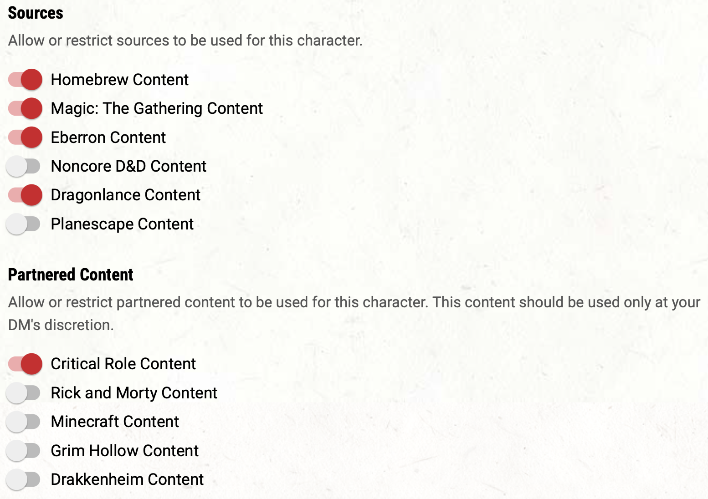

# New to D&D

## Step-by-Step: Making your first character on DnD Beyond

### Getting Started
> - Make a D&D Beyond account if you don’t already have one: [https://www.dndbeyond.com/create-account](https://www.dndbeyond.com/create-account)
> - Go to "Create a Character"
> - Choose "Standard" Character Creation Method
> - Check "Show Help Text". This gives you overview of various D&D concepts that are useful for creating a character.
>
> You could use "Quick Build" as well, which will make a generic character for you.

> Read the help texts. As you go through the help texts, if anything is unclear or confusing, please direct your questions to `#⁠beginner-help`.

### Character Preferences (settings)

> - **Dice Rolling**: Off
>   - We use Avrae Discord bot for this, not DnD Beyond
> - **Optional Features**: On
> - **Advancement Type**: Milestone
> - **Hit Point Type**
>   - "Fixed" recommended
>   - If you choose "Manual", you MUST make the rolls in `⁠#official-character-rolls`, NOT in D&D Beyond
> - Leave the rest of the options as they are. Make sure **Character Privacy** is set to "Public"

{. highlight }
The players on this server can get access to paid material, sponsored by D&D Beyond and patrons of the server. For the rules please refer to [`#⁠ddb-link-request`](https://discord.com/channels/512870694883950598/756319993616138310/923880816239591425)

---

## D&D Beyond Character Builder

### 1. Race
> Races refer to human, elves, dwarves, etc. Each race can provide some mechanical benefit to your character in game, such as stats, traits, or even spells! For approved/disapproved materials, see `Character Creation Rules`
> - More extensive descriptions on races can be found here: https://www.dndbeyond.com/races
>
> However, as we are not using the WOTC world, take their descriptions and lore with a grain of salt, e.g. Tieflings are pretty common in the server so they do not suffer as much discrimination as described.
