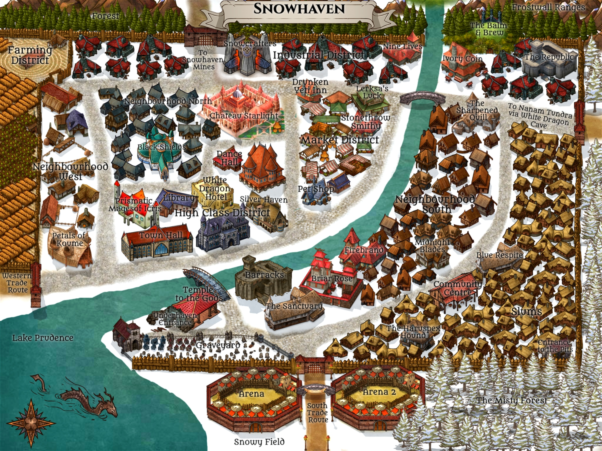

# Welcome Adventurers! 

You are about to join a homebrew text-only server where you will take on bounties West Marches style, meet hundreds of new people, and live out an epic life of an adventurer. 

## Who We Are
> - The largest text-based D&D living world!
> - Friendly community that welcomes and teaches newbies
> - The world is in a homebrew medieval fantasy setting
> - West Marches style server: There is no set plot, and a party changes for each DM event. However, the games are scheduled and run by multiple volunteer DMs with sign-ups from players

> - Not a voice chat (VC) game server
> - Not a Looking for Group (LFG) server
> - Not a shared setting with any partner servers
> - Not in Forgotten Realms setting
> - Not affiliated with AL (Adventurer’s League) in any way. No XP can be transferred to/from AL

## What We Do
> - 24/7 Active and family-friendly Roleplays
> - Games in Live text sessions
> - Mobile-friendly text games
> - Google Sheet maps (Not VTTs)

> - No campaigns: We roleplay with our characters living in this world, and play one-shots that your characters join as “bounties”. You do not need to form your own party.

## A Few Words
> - We would appreciate it if you would take the time to read the `#rules` if you haven't already. Every rule is there for a reason.
> - Please refer to `#character-creation-rules` for accepted books and UA/Homebrew. 
> - Our staff team is here to help you should you have any problems or questions along the way, so don't be afraid to ask for help in `#server-questions`

> - If you don’t think DW is what you are looking for, you may find something that better suits your taste in our `#partner-servers`.

---

## World Setting

You are on the mainland known as Icris. Icris is a fantasy setting with its own pantheon of gods that the people heavily worship and have allocated several large areas of holy lands to. Icris uses a fictional calendar, with the IRL year of 2018 being equivalent to 20X0. The names of months and weeks are otherwise the same. For more lore, visit `#⁠lore` and our [World Anvil page](https://www.worldanvil.com/w/icris-dnd-world)

{: .warning-title }
> Important
>
> No guns or firearm lookalikes exist in this world. No sci-fi, no references to other franchises, no urban technology, no references to events on Earth.

---

## Snowhaven, Nanam

This is the hub town where all characters gather. **Snowhaven** is a city set in a snowy taiga, where the weather is often cold. The climate is based off Baffin Island, Canada.

It is a new settlement, established in 20X1 (2019 in IRL years). It was formed after the residents of the previous town setting, Plater Village, moved due to a combination of catastrophic events including but not limited to, a private army invading, a forest burning down, and the gods raiding the temple after an ancient titan awoke.

The majority race is humans followed by elves, half-elves, and tieflings, but there isn't discrimination to the other races.

----

[^1]: [It can take up to 10 minutes for changes to your site to publish after you push the changes to GitHub](https://docs.github.com/en/pages/setting-up-a-github-pages-site-with-jekyll/creating-a-github-pages-site-with-jekyll#creating-your-site).

[Just the Docs]: https://just-the-docs.github.io/just-the-docs/
[GitHub Pages]: https://docs.github.com/en/pages
[README]: https://github.com/just-the-docs/just-the-docs-template/blob/main/README.md
[Jekyll]: https://jekyllrb.com
[GitHub Pages / Actions workflow]: https://github.blog/changelog/2022-07-27-github-pages-custom-github-actions-workflows-beta/
[use this template]: https://github.com/just-the-docs/just-the-docs-template/generate